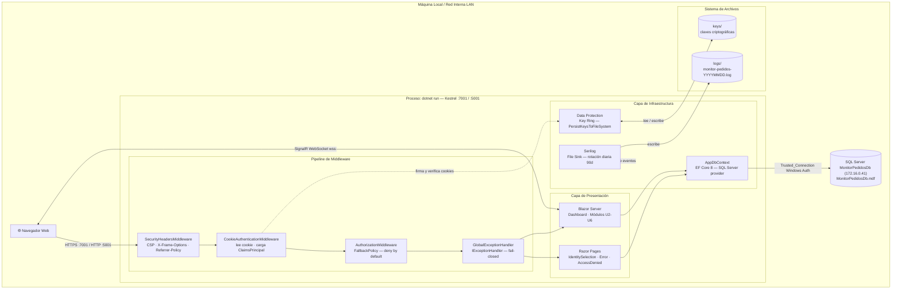

# Deployment Architecture — U1 Foundation & Cross-Cutting

**Unidad:** U1 — Foundation & Cross-Cutting
**Stage:** Construction → Infrastructure Design
**Fecha:** 2026-05-23
**Versión:** 1.1 *(actualizado 2026-05-23 — diagrama ASCII reemplazado por Mermaid)*

---

## §1 Vista general de arquitectura de despliegue



**Acceso desde red interna:** otros equipos de la misma LAN acceden via `http://[ip-maquina]:5001` configurando Kestrel con `applicationUrl: http://0.0.0.0:5001`.

---

## §2 Prerrequisitos por máquina

Estos componentes deben estar instalados en la máquina que ejecuta el sistema:

| Componente | Versión mínima | Cómo verificar |
|------------|---------------|----------------|
| .NET SDK | 8.x | `dotnet --version` |
| SQL Server MonitorPedidosDb (172.16.0.41) | 2019+ | `sqllocaldb info` |
| dotnet dev-certs | (incluido en SDK) | `dotnet dev-certs https --check` |

**SQL Server MonitorPedidosDb (172.16.0.41)** se instala con:
- Visual Studio (cualquier edición, incluyendo Community)
- SQL Server Express
- Instalador standalone: [SQL Server MonitorPedidosDb (172.16.0.41)](https://learn.microsoft.com/en-us/sql/database-engine/configure-windows/sql-server-express-localdb)

---

## §3 Setup inicial (primera vez)

Ejecutar en orden la primera vez que se instala el sistema en una máquina:

```bash
# 1. Clonar / copiar el proyecto
cd C:\Estacion4\PRD_AI_DLC\MonitorPedidos

# 2. Restaurar paquetes NuGet
dotnet restore --use-lock-file

# 3. Confiar en el certificado HTTPS de desarrollo (una vez por máquina)
dotnet dev-certs https --trust

# 4. Crear la base de datos y aplicar migrations
dotnet ef database update --project src/MonitorPedidos.Web

# 5. Arrancar la aplicación
dotnet run --project src/MonitorPedidos.Web --launch-profile https
```

Abrir en el navegador: `https://localhost:7001`

---

## §4 Operación normal (arranques posteriores)

```bash
# Solo se necesita:
dotnet run --project src/MonitorPedidos.Web --launch-profile https
```

El directorio `keys/` ya existe y las cookies previas siguen siendo válidas (Data Protection persistido en disco).

---

## §5 Ciclo de vida de migrations (U1 → U2 → ...)

Cada unidad que agrega entidades de negocio requiere una nueva migration:

| Unidad | Qué agrega | Comando |
|--------|-----------|---------|
| U1 | Schema base (`InitialCreate`, posiblemente vacía) | `dotnet ef migrations add InitialCreate` |
| U2 | Tablas `Incidents`, `Checks`, etc. | `dotnet ef migrations add AddIncidentSchema` |
| U5 | Tablas de reglas | `dotnet ef migrations add AddRulesSchema` |

**Aplicar migrations tras cada deploy:**
```bash
dotnet ef database update --project src/MonitorPedidos.Web
```

---

## §6 Configuración para demo en red interna

Para que otros equipos de la red accedan al sistema (demo):

**Opción 1 — HTTP en LAN (más simple):**
```json
// launchSettings.json — perfil "lan"
{
  "commandName": "Project",
  "applicationUrl": "http://0.0.0.0:5001",
  "environmentVariables": {
    "ASPNETCORE_ENVIRONMENT": "Production"
  }
}
```
Acceso desde otros equipos: `http://[ip-maquina-demo]:5001`

**Opción 2 — HTTPS en LAN (requiere certificado de red):**
No recomendado para MVP — requiere certificado válido para IP/hostname de red. La Opción 1 es suficiente para demos internas.

---

## §7 Estructura final de directorios en disco

```
C:\Estacion4\PRD_AI_DLC\MonitorPedidos\     (workspace root)
+-- src\
|   +-- MonitorPedidos.Domain\
|   +-- MonitorPedidos.Infrastructure\
|   +-- MonitorPedidos.Web\
|       +-- keys\                           (Data Protection — .gitignore)
|       +-- logs\                           (Serilog — .gitignore)
|       +-- appsettings.json
|       +-- appsettings.Development.json
|       +-- wwwroot\
+-- tests\
|   +-- MonitorPedidos.IntegrationTests\
+-- aidlc-docs\
+-- .gitignore
+-- MonitorPedidos.sln
```

---

## §8 Seguridad en despliegue

| Control | Implementación | Estado |
|---------|---------------|--------|
| `keys/` no en repositorio | `.gitignore` | Requerido antes de primer commit |
| `logs/` no en repositorio | `.gitignore` | Requerido antes de primer commit |
| Sin credenciales hardcodeadas en U1 | Connection string usa `Trusted_Connection=True` (Windows auth) | Cumplido — no hay password en connection string |
| Secretos de U4 (Salesforce, Multivende) | User Secrets / variables de entorno | Aplica en U4, no en U1 |
| `ASPNETCORE_ENVIRONMENT=Production` en demo | Desactiva páginas de error detalladas | Operador debe configurar antes de demo |
