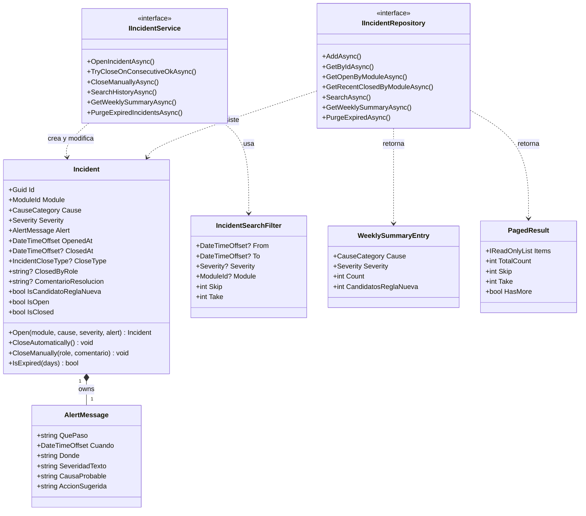

    # Domain Entities — U2 Persistence & Incidents

**Unidad:** U2 — Persistence & Incidents
**Stage:** Construction → Functional Design
**Fecha:** 2026-05-23
**Versión:** 1.0
**Fuentes:**
- `aidlc-docs/inception/application-design/unit-of-work.md` §U2
- `aidlc-docs/inception/application-design/components.md` §1.9, §2.1, §2.3
- `aidlc-docs/construction/u1-foundation-cross-cutting/functional-design/domain-entities.md` (tipos heredados)

---

## §1 Bounded Context — Incidents

| Atributo | Detalle |
|----------|---------|
| **Nombre** | Incidents |
| **Responsabilidad** | Ciclo de vida completo de un incidente: apertura, cierre automático (2 OK consecutivos), cierre manual con comentario obligatorio, consulta histórica paginada, resumen semanal y purga por retención de 90 días |
| **Aggregate Root** | `Incident` |
| **Límite de consistencia** | Un `Incident` se abre, se cierra y se purga como unidad atómica. No existen relaciones bidireccionales con otras entidades de negocio dentro de este bounded context |
| **RFs cubiertos** | RF-18 (persistencia), RF-19 (cierre automático 2 OK), RF-20 (cierre manual + comentario), RF-21 (retención 90 días), RF-22 (consulta histórica filtrada) |
| **Stories** | US-05, US-11, US-12, US-13, US-14 |

**Tipos heredados de U1 (se usan sin redefinir):**
`Severity`, `CauseCategory`, `ModuleId`, `IncidentCloseType`, `AlertMessage`, `CheckStatus`

---

## §2 Aggregate Root: `Incident`

### 2.1 Definición

```csharp
// MonitorPedidos.Domain/Incidents/Incident.cs
public sealed class Incident
{
    public Guid             Id                    { get; private set; }
    public ModuleId         Module                { get; private set; }
    public CauseCategory    Cause                 { get; private set; }
    public Severity         Severity              { get; private set; }
    public AlertMessage     Alert                 { get; private set; }   // owned value object
    public DateTimeOffset   OpenedAt              { get; private set; }
    public DateTimeOffset?  ClosedAt              { get; private set; }
    public IncidentCloseType? CloseType           { get; private set; }
    public string?          ClosedByRole          { get; private set; }   // "Operador" | "Técnico"
    public string?          ComentarioResolucion  { get; private set; }
    public bool             IsCandidatoReglaNueva { get; private set; }

    // Computed
    public bool IsOpen    => ClosedAt is null;
    public bool IsClosed  => ClosedAt is not null;
}
```

### 2.2 Invariantes de dominio

| ID | Invariante |
|----|-----------|
| INV-01 | Un incidente abierto (`IsOpen == true`) no puede abrirse de nuevo — `OpenIncident` es idempotente por módulo activo |
| INV-02 | `CloseManually` requiere `ComentarioResolucion` no nulo y no vacío — lanza `DomainException` si se viola |
| INV-03 | Una vez cerrado, un incidente no puede reabrirse (inmutable tras cierre) |
| INV-04 | `IsCandidatoReglaNueva = true` solo cuando `Cause == CauseCategory.NoDeterminada` |
| INV-05 | `ClosedByRole` solo aplica para `CloseType == Manual`; es nulo para cierres automáticos |

### 2.3 Factory y comportamiento

```csharp
public sealed class Incident
{
    // Constructor privado — solo accesible vía factory
    private Incident() { }

    // Factory method — abre un nuevo incidente
    public static Incident Open(
        ModuleId module,
        CauseCategory cause,
        Severity severity,
        AlertMessage alert)
    {
        return new Incident
        {
            Id                    = Guid.NewGuid(),
            Module                = module,
            Cause                 = cause,
            Severity              = severity,
            Alert                 = alert,
            OpenedAt              = DateTimeOffset.UtcNow,
            IsCandidatoReglaNueva = cause == CauseCategory.NoDeterminada
        };
    }

    // Cierra automáticamente tras 2 OK consecutivos del mismo módulo
    public void CloseAutomatically()
    {
        if (IsClosed) throw new DomainException("El incidente ya está cerrado.");
        ClosedAt   = DateTimeOffset.UtcNow;
        CloseType  = IncidentCloseType.Automatic;
    }

    // Cierra manualmente — requiere comentario obligatorio
    public void CloseManually(string closedByRole, string comentario)
    {
        if (IsClosed) throw new DomainException("El incidente ya está cerrado.");
        if (string.IsNullOrWhiteSpace(comentario))
            throw new DomainException("El comentario de resolución es obligatorio para cierre manual.");

        ClosedAt              = DateTimeOffset.UtcNow;
        CloseType             = IncidentCloseType.Manual;
        ClosedByRole          = closedByRole;
        ComentarioResolucion  = comentario.Trim();
    }

    // Determina si el incidente superó el período de retención
    public bool IsExpired(int retentionDays) =>
        OpenedAt < DateTimeOffset.UtcNow.AddDays(-retentionDays);
}
```

---

## §3 Value Objects

### 3.1 `AlertMessage` (heredado de U1 — redefinición de uso)

Definido en `MonitorPedidos.Domain/Alerts/AlertMessage.cs` (U1). En U2 se usa como **propiedad poseída (OwnsOne)** dentro de `Incident`.

| Campo | Tipo | Descripción |
|-------|------|-------------|
| `QuePaso` | `string` | Descripción del evento detectado |
| `Cuando` | `DateTimeOffset` | Timestamp del evento |
| `Donde` | `string` | Módulo afectado en texto legible |
| `SeveridadTexto` | `string` | Severidad en español ("Crítico", "Advertencia", etc.) |
| `CausaProbable` | `string` | Causa clasificada en texto |
| `AccionSugerida` | `string` | Pasos recomendados (puede incluir referencia a SOP-001) |

**Mapping EF Core:** `OwnsOne<AlertMessage>` con columnas prefijadas `Alert_*` en la tabla `incidents`.

---

### 3.2 `IncidentSearchFilter`

Parámetro de consulta para búsqueda histórica paginada (US-11).

```csharp
// MonitorPedidos.Domain/Incidents/IncidentSearchFilter.cs
public sealed record IncidentSearchFilter(
    DateTimeOffset? From     = null,
    DateTimeOffset? To       = null,
    Severity?       Severity = null,
    ModuleId?       Module   = null,
    int             Skip     = 0,
    int             Take     = 20
)
{
    public const int MaxTake = 100;

    // Invariante: Take no puede exceder MaxTake
    public IncidentSearchFilter WithValidatedTake() =>
        this with { Take = Math.Min(Take, MaxTake) };
}
```

---

### 3.3 `WeeklySummaryEntry`

Elemento del resumen semanal agrupado por causa y severidad (US-12).

```csharp
// MonitorPedidos.Domain/Incidents/WeeklySummaryEntry.cs
public sealed record WeeklySummaryEntry(
    CauseCategory Cause,
    Severity      Severity,
    int           Count,
    int           CandidatosReglaNueva
);
```

---

### 3.4 `PagedResult<T>`

Envuelve resultados paginados. Usado por `SearchHistoryAsync`.

```csharp
// MonitorPedidos.Domain/Shared/PagedResult.cs
public sealed record PagedResult<T>(
    IReadOnlyList<T> Items,
    int              TotalCount,
    int              Skip,
    int              Take
)
{
    public bool HasMore => Skip + Items.Count < TotalCount;
}
```

---

## §4 Interfaces de dominio (contratos)

### 4.1 `IIncidentRepository`

```csharp
// MonitorPedidos.Domain/Incidents/IIncidentRepository.cs
public interface IIncidentRepository
{
    Task AddAsync(Incident incident, CancellationToken ct = default);

    Task<Incident?> GetByIdAsync(Guid id, CancellationToken ct = default);

    // Retorna el incidente ABIERTO activo de un módulo (máximo 1 por módulo)
    Task<Incident?> GetOpenByModuleAsync(ModuleId module, CancellationToken ct = default);

    // Retorna los últimos N incidentes cerrados de un módulo (para evaluar 2 OK consecutivos)
    Task<IReadOnlyList<Incident>> GetRecentClosedByModuleAsync(
        ModuleId module, int count, CancellationToken ct = default);

    Task<PagedResult<Incident>> SearchAsync(
        IncidentSearchFilter filter, CancellationToken ct = default);

    Task<IReadOnlyList<WeeklySummaryEntry>> GetWeeklySummaryAsync(
        DateOnly weekStart, CancellationToken ct = default);

    // Elimina incidentes con OpenedAt < UtcNow - retentionDays. Retorna cantidad eliminada.
    Task<int> PurgeExpiredAsync(int retentionDays, CancellationToken ct = default);

    Task SaveChangesAsync(CancellationToken ct = default);
}
```

---

### 4.2 `IIncidentService`

```csharp
// MonitorPedidos.Domain/Incidents/IIncidentService.cs
public interface IIncidentService
{
    // Abre un nuevo incidente. Si ya hay uno abierto para el módulo, retorna el existente (idempotente).
    Task<Incident> OpenIncidentAsync(
        ModuleId module, CauseCategory cause, Severity severity,
        AlertMessage alert, CancellationToken ct = default);

    // Evalúa si hay 2 OK consecutivos para el módulo y cierra el incidente abierto si aplica.
    // Retorna true si cerró un incidente, false si no había incidente abierto o no había 2 OK.
    Task<bool> TryCloseOnConsecutiveOkAsync(ModuleId module, CancellationToken ct = default);

    // Cierra manualmente. Lanza DomainException si comentario vacío.
    Task CloseManuallyAsync(
        Guid incidentId, string closedByRole, string comentario,
        CancellationToken ct = default);

    Task<PagedResult<Incident>> SearchHistoryAsync(
        IncidentSearchFilter filter, CancellationToken ct = default);

    Task<IReadOnlyList<WeeklySummaryEntry>> GetWeeklySummaryAsync(
        DateOnly weekStart, CancellationToken ct = default);

    // Ejecuta la purga de retención. Retorna cantidad de incidentes eliminados.
    Task<int> PurgeExpiredIncidentsAsync(CancellationToken ct = default);
}
```

---

## §5 Mapping EF Core — tabla `incidents`

| Columna | Tipo SQL | Propiedad C# | Notas |
|---------|----------|-------------|-------|
| `Id` | `uniqueidentifier` PK | `Id` | GUID generado en dominio |
| `Module` | `nvarchar(50)` | `Module` | Enum → string |
| `Cause` | `nvarchar(50)` | `Cause` | Enum → string |
| `Severity` | `nvarchar(20)` | `Severity` | Enum → string |
| `Alert_QuePaso` | `nvarchar(500)` | `Alert.QuePaso` | OwnsOne |
| `Alert_Cuando` | `datetimeoffset` | `Alert.Cuando` | OwnsOne |
| `Alert_Donde` | `nvarchar(100)` | `Alert.Donde` | OwnsOne |
| `Alert_SeveridadTexto` | `nvarchar(50)` | `Alert.SeveridadTexto` | OwnsOne |
| `Alert_CausaProbable` | `nvarchar(300)` | `Alert.CausaProbable` | OwnsOne |
| `Alert_AccionSugerida` | `nvarchar(500)` | `Alert.AccionSugerida` | OwnsOne |
| `OpenedAt` | `datetimeoffset` NOT NULL | `OpenedAt` | Índice para purga y filtrado |
| `ClosedAt` | `datetimeoffset` NULL | `ClosedAt` | NULL = abierto |
| `CloseType` | `nvarchar(20)` NULL | `CloseType` | Enum → string |
| `ClosedByRole` | `nvarchar(50)` NULL | `ClosedByRole` | Solo para cierre manual |
| `ComentarioResolucion` | `nvarchar(1000)` NULL | `ComentarioResolucion` | Solo para cierre manual |
| `IsCandidatoReglaNueva` | `bit` NOT NULL | `IsCandidatoReglaNueva` | Default false |

**Índices:**
- `IX_incidents_OpenedAt` — consultas de purga y filtrado temporal
- `IX_incidents_Module_ClosedAt` — consulta de incidente abierto por módulo
- `IX_incidents_Module_CloseType_ClosedAt` — evaluación de 2 OK consecutivos

---

## §6 Diagrama del Bounded Context



---

## §7 Trazabilidad

| Elemento | RF | Story | Componente destino |
|----------|-----|-------|--------------------|
| `Incident.Open()` | RF-18 | US-05 | `IncidentService.OpenIncidentAsync` |
| `Incident.CloseAutomatically()` | RF-19 | US-14 | `IncidentService.TryCloseOnConsecutiveOkAsync` |
| `Incident.CloseManually()` + INV-02 | RF-20 | US-13 | `IncidentService.CloseManuallyAsync` |
| `IIncidentRepository.PurgeExpiredAsync` | RF-21 | — | Job de purga semanal |
| `IIncidentRepository.SearchAsync` | RF-22 | US-11 | `HistoricPage.razor` |
| `IIncidentRepository.GetWeeklySummaryAsync` | RF-22 | US-12 | `WeeklySummaryPage.razor` |
| `INV-04` (`IsCandidatoReglaNueva`) | RF-18 | US-18 | `CauseClassifier` (U3) |
