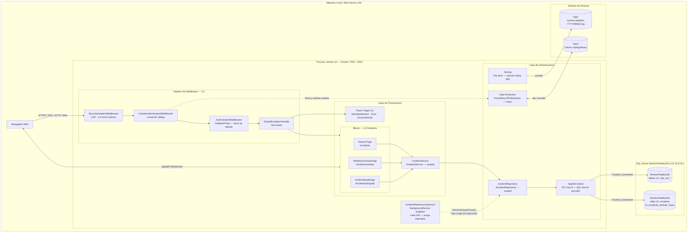

# Deployment Architecture — U2 Persistence & Incidents

**Unidad:** U2 — Persistence & Incidents
**Stage:** Construction → Infrastructure Design
**Fecha:** 2026-05-23
**Versión:** 1.0

> **Nota:** U2 no modifica el proceso de despliegue de U1. Este diagrama extiende el de U1 mostrando los componentes nuevos que U2 agrega al mismo proceso Kestrel.

---

## §1 Diagrama de arquitectura de despliegue — U1 + U2



---

## §2 Componentes nuevos que agrega U2

| Componente | Tipo | Ciclo de vida | Nota |
|-----------|------|--------------|------|
| `HistoricPage` | Blazor Page | Transient (por circuito) | Ruta `/incidents` |
| `WeeklySummaryPage` | Blazor Page | Transient (por circuito) | Ruta `/incidents/weekly` |
| `IncidentDetailPage` | Blazor Page | Transient (por circuito) | Ruta `/incidents/{id:guid}` |
| `IncidentService` | Application Service | Scoped | Implementa `IIncidentService` |
| `IncidentRepository` | EF Core Repository | Scoped | Implementa `IIncidentRepository` |
| `IncidentMaintenanceService` | BackgroundService | **Singleton** | Corre en hilo de fondo — cada 24h |
| Tabla `incidents` | SQL Schema | — | Creada por migration `AddIncidentSchema` |

---

## §3 Detalle del BackgroundService

`IncidentMaintenanceService` es singleton pero necesita `IIncidentRepository` (scoped). El patrón correcto es `IServiceScopeFactory`:

```
IncidentMaintenanceService (singleton)
    |
    +-- cada 24h -->
        IServiceScopeFactory.CreateAsyncScope()
            |
            +-- resuelve IIncidentRepository (scoped dentro del scope)
            +-- llama PurgeExpiredAsync(retentionDays, ct)
            +-- scope se destruye → DbContext se libera
```

Sin `IServiceScopeFactory`, el DI de ASP.NET Core lanzaría `InvalidOperationException: Cannot consume scoped service from singleton`.

---

## §4 Migration AddIncidentSchema

```bash
# Crear la migration (solo la primera vez, al desarrollar U2)
dotnet ef migrations add AddIncidentSchema --project src/MonitorPedidos.Web

# Aplicar antes del primer arranque con U2
dotnet ef database update --project src/MonitorPedidos.Web
```

Lo que crea esta migration en MonitorPedidosDb:

| Objeto | Tipo |
|--------|------|
| `incidents` | Tabla — 17 columnas |
| `IX_incidents_OpenedAt` | Índice simple |
| `IX_incidents_Module_ClosedAt` | Índice compuesto |
| `IX_incidents_Module_Open` | **Índice único filtrado** `WHERE ClosedAt IS NULL` |

---

## §5 Sin cambios vs U1

Los siguientes aspectos del despliegue **no cambian** con U2:

| Aspecto | Estado |
|---------|--------|
| Proceso de arranque (`dotnet run`) | Sin cambios |
| Puerto Kestrel (`:7001` / `:5001`) | Sin cambios |
| Certificado HTTPS (`dev-certs`) | Sin cambios |
| `keys/` Data Protection | Sin cambios |
| `logs/` Serilog | Sin cambios — U2 escribe en el mismo sink |
| Acceso desde red interna LAN | Sin cambios — ver §6 de U1 `deployment-architecture.md` |
