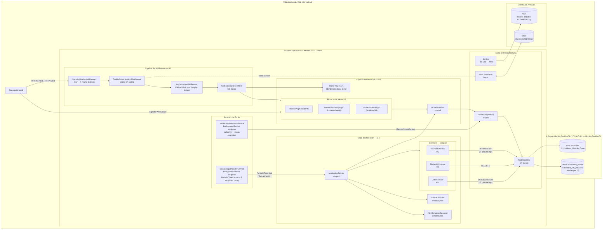

# Deployment Architecture — U3 Detection & Classification

**Unidad:** U3 — Detection & Classification
**Stage:** Construction → Infrastructure Design
**Fecha:** 2026-05-23
**Versión:** 1.0

> **Nota:** U3 no modifica el proceso de despliegue ni los puertos. Este diagrama extiende el de U2 agregando los componentes de detección y clasificación al mismo proceso Kestrel.

---

## §1 Diagrama de arquitectura de despliegue — U1 + U2 + U3



---

## §2 Componentes nuevos que agrega U3

| Componente | Tipo | Ciclo de vida | Nota |
|-----------|------|--------------|------|
| `MonitoringSchedulerService` | BackgroundService | **Singleton** | `PeriodicTimer` — 5 min prod / 1 min dev |
| `MonitoringService` | Application Service | Scoped | Orquesta checker → classify → render → incident → notify |
| `DbOrderChecker` | ICheckExecutor | Scoped | Usa `IOrderSource` (implementado por U7) |
| `DbHealthChecker` | ICheckExecutor | Scoped | `SELECT 1` directo a `AppDbContext` |
| `JobsChecker` | ICheckExecutor | Scoped | Usa `IJobStatusSource` (implementado por U7) |
| `CauseClassifier` | Clase estática | Sin DI | Determinista — lookup por tipo de checker |
| `AlertTemplateRenderer` | Clase estática | Sin DI | Diccionario C# de plantillas en español |

---

## §3 Flujo de detección en el proceso (cada tick)

```
MonitoringSchedulerService (singleton — fondo)
    |
    PeriodicTimer dispara cada 5 min
    |
    IServiceScopeFactory.CreateAsyncScope()
    |
    Task.WhenAll([DbOrderChecker, DbHealthChecker, JobsChecker])
         cada uno con Linked CancellationToken + timeout 30s
    |
    MonitoringService.RunCheckAsync(checker, ct)
         [WARN/CRITICAL] → CauseClassifier → AlertTemplateRenderer
                         → IncidentService.OpenIncidentAsync
                         → INotificationService.BroadcastAlertAsync (stub → real en U6)
         [OK]            → IncidentService.TryCloseOnConsecutiveOkAsync
```

---

## §4 Sin cambios vs U2

| Aspecto | Estado |
|---------|--------|
| Proceso de arranque (`dotnet run`) | Sin cambios |
| Puertos Kestrel (`:7001` / `:5001`) | Sin cambios |
| `AppDbContext` | Sin cambios en U3 — U7 agrega DbSets |
| `keys/` y `logs/` | Sin cambios |
| Migration | Sin migration en U3 — U7 crea `AddSimulatedTables` |
| Acceso LAN | Sin cambios |
