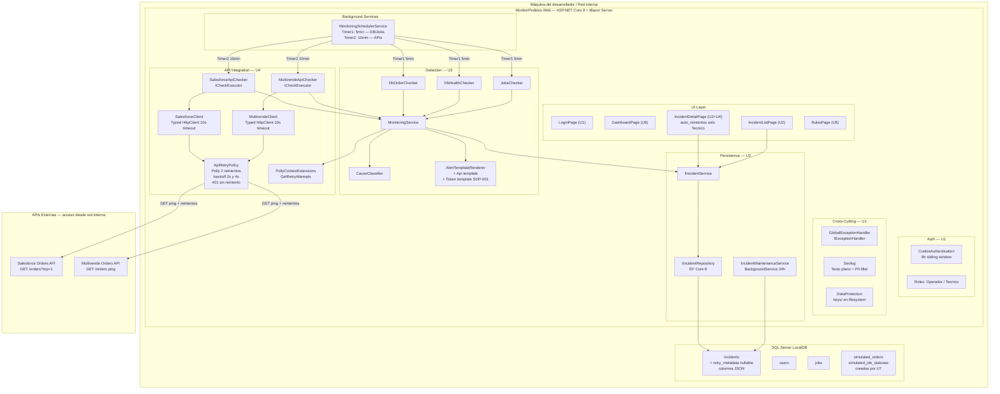

# Deployment Architecture — U4 External Integrations

**Unidad:** U4 — External Integrations
**Stage:** Construction → Infrastructure Design
**Fecha:** 2026-05-23
**Versión:** 1.0
**Acumulado desde:** U1

---

## §1 Diagrama de despliegue (U1 + U2 + U3 + U4)



---

## §2 Flujo de datos — ciclo de API checker con reintentos

```
MonitoringSchedulerService
    Timer2 (10 min) tick
        |
        Task.WhenAll([SalesforceApiChecker, MultivendeApiChecker])
            |
            SalesforceApiChecker.ExecuteAsync(ct)
                |
                SalesforceClient.PingOrdersAsync(ct)
                    |
                    [Polly intercepta]
                    Intento 1: GET /orders?$top=1 → 503
                    onRetry → RetryAttempt(1, 503, latencia) → context["retryAttempts"]
                    espera 2s
                    Intento 2: GET /orders?$top=1 → 503
                    onRetry → RetryAttempt(2, 503, latencia) → context["retryAttempts"]
                    espera 4s
                    Intento 3: GET /orders?$top=1 → falla
                    → ApiPingResult.ServerError
                |
                CheckResult.Critical("Salesforce HTTP 5xx")
                |
            MonitoringService.RunCheckAsync
                cause = Api (via CauseClassifier)
                alert = AlertTemplateRenderer → "2 reintentos automaticos realizados"
                incident = IIncidentService.OpenIncidentAsync(...)
                retryAttempts = context.GetRetryAttempts()   [2 items]
                incident.AddRetryAttempt(attempt1)
                incident.AddRetryAttempt(attempt2)
                → incidents table: retry_metadata = "[{...},{...}]"
                INotificationService.BroadcastAlertAsync → SignalR (U6)
```

---

## §3 Artefactos de infraestructura por unidad (acumulado)

| Unidad | Migraciones EF | Configuración | Proyectos | BackgroundServices |
|--------|---------------|--------------|----------|-------------------|
| U1 | InitialCreate (users) | HTTPS dev-certs, cookies, Data Protection | MonitorPedidos.Web | — |
| U2 | InitialCreate (incidents, jobs) | RetentionDays: 90 | — | IncidentMaintenanceService |
| U3 | — | CheckerIntervalMinutes: 5 (prod) / 1 (dev) | MonitorPedidos.UnitTests | MonitoringSchedulerService (Timer1) |
| U4 | AddRetryMetadataToIncidents | ApiCheckerIntervalMinutes: 10 (prod) / 1 (dev) | — (UnitTests ya existe) | MonitoringSchedulerService (Timer2 agregado) |
| U5 | (pendiente) | — | — | — |
| U6 | (pendiente) | — | — | — |
| U7 | simulated_orders, simulated_job_statuses | — | — | — |

---

## §4 Trazabilidad

| Componente de infraestructura | Story | NFR | ADR |
|------------------------------|-------|-----|-----|
| Migración AddRetryMetadataToIncidents | US-10, US-16 | — | ADR-U4-01 |
| ApiCheckerIntervalMinutes en appsettings | US-10 | NFR-U4-01 | BR-SCHED-05 |
| AddSingleton ICheckExecutor (Salesforce, Multivende) | US-10 | — | ADR-U3-02, ADR-U4-03 |
| AddHttpClient + AddPolicyHandler | US-10 | NFR-U4-01 | ADR-U4-02 |
| User Secrets (Salesforce:ApiKey, Multivende:ApiKey) | — | SECURITY-03 | BR-CRED-01 |
| RichardSzalay.MockHttp en UnitTests | US-10, US-16 | NFR-U4-02, NFR-U4-03 | ADR-U4-04 |
