# Deployment Architecture — U5 Rules Management

**Unidad:** U5 — Rules Management
**Stage:** Construction → Infrastructure Design
**Fecha:** 2026-05-24
**Versión:** 1.0
**Acumulado desde:** U1

---

## §1 Diagrama de despliegue (U1 + U2 + U3 + U4 + U5)

```mermaid
graph TD
    subgraph DEV["Máquina del desarrollador / Red interna"]

        subgraph APP["MonitorPedidos.Web — ASP.NET Core 8 + Blazor Server"]

            subgraph UI["UI Layer"]
                LoginPage["LoginPage (U1)"]
                DashboardPage["DashboardPage (U6)"]
                IncidentList["IncidentListPage (U2)"]
                IncidentDetail["IncidentDetailPage (U2+U4)\nauto_reintentos solo Tecnico"]
                RulesPage["RulesPage (U5)\nAuthorize Tecnico"]
                RuleEditPage["RuleEditPage (U5)\nAuthorize Tecnico"]
                RuleHistoryPage["RuleHistoryPage (U5)\nAuthorize Tecnico"]
            end

            subgraph AUTH["Auth — U1"]
                CookieAuth["CookieAuthentication\n8h sliding window"]
                Roles["Roles: Operador / Tecnico"]
            end

            subgraph CROSS["Cross-Cutting — U1"]
                GEH["GlobalExceptionHandler\nIExceptionHandler"]
                SERI["Serilog\nTexto plano + PII filter"]
                DP["DataProtection\nkeys/ en filesystem"]
            end

            subgraph PERSIST["Persistence — U2"]
                IS["IIncidentService"]
                IR["IIncidentRepository\nEF Core 8"]
                IMS["IncidentMaintenanceService\nBackgroundService 24h"]
            end

            subgraph DETECT["Detection — U3"]
                MS["MonitoringService"]
                DOC["DbOrderChecker\nSingleton + IServiceScopeFactory"]
                DHC["DbHealthChecker"]
                JC["JobsChecker"]
                CC["CauseClassifier"]
                ATR["AlertTemplateRenderer"]
            end

            subgraph APIINT["API Integration — U4"]
                SAC["SalesforceApiChecker\nICheckExecutor"]
                MAC["MultivendeApiChecker\nICheckExecutor"]
                SC["SalesforceClient\nTyped HttpClient 10s"]
                MC["MultivendeClient\nTyped HttpClient 10s"]
                ARP["ApiRetryPolicy\nPolly 2 reintentos\n401 sin reintento"]
                PCX["PollyContextExtensions"]
            end

            subgraph RULES["Rules Management — U5"]
                IRMS["IRuleManagementService\nScoped"]
                RMS["RuleManagementService\nScoped — orquestador"]
                IREP["IRuleRepository\nScoped"]
                IHREP["IRuleHistoryRepository\nScoped"]
                RREP["RuleRepository\nEF Core"]
                RHREP["RuleHistoryRepository\nEF Core — sin Update ni Delete"]
            end

            subgraph BG["Background Services"]
                MSS["MonitoringSchedulerService\nTimer1: 5min — DB/Jobs\nTimer2: 10min — APIs"]
            end

        end

        subgraph DB["SQL Server LocalDB"]
            INC["incidents\n+ retry_metadata nullable JSON"]
            USR["users"]
            JOB["jobs"]
            RUL["rules\nrule_history\nseed: 2 reglas iniciales"]
            SIM["simulated_orders\nsimulated_job_statuses\ncreadas por U7"]
        end

    end

    subgraph EXT["APIs Externas — acceso desde red interna"]
        SFAPI["Salesforce Orders API\nGET /orders?top=1"]
        MVAPI["Multivende Orders API\nGET /orders ping"]
    end

    MSS -->|"Timer1 5min"| DOC
    MSS -->|"Timer1 5min"| DHC
    MSS -->|"Timer1 5min"| JC
    MSS -->|"Timer2 10min"| SAC
    MSS -->|"Timer2 10min"| MAC

    DOC -->|"IServiceScopeFactory\nscope por tick"| IREP
    DOC --> MS
    DHC --> MS
    JC --> MS
    SAC --> SC
    MAC --> MC
    SC --> ARP
    MC --> ARP
    ARP -->|"GET ping + reintentos"| SFAPI
    ARP -->|"GET ping + reintentos"| MVAPI
    SAC --> MS
    MAC --> MS

    MS --> CC
    MS --> ATR
    MS --> IS
    MS --> PCX

    IS --> IR
    IR --> INC
    IMS --> INC
    IncidentDetail --> IS
    IncidentList --> IS

    RulesPage --> IRMS
    RuleEditPage --> IRMS
    RuleHistoryPage --> IRMS
    IRMS --> RMS
    RMS --> IREP
    RMS --> IHREP
    IREP --> RREP
    IHREP --> RHREP
    RREP --> RUL
    RHREP --> RUL
```



---

## §2 Flujo de datos — ciclo de DbOrderChecker con reglas configurables

```
MonitoringSchedulerService
    Timer1 (5 min) tick
        |
        DbOrderChecker.ExecuteAsync(ct)
            |
            IServiceScopeFactory.CreateAsyncScope()
                |
                IRuleRepository.GetActiveByModuleAsync(DbOrders, ct)
                    → rule = Rule { ConditionJson: "{windowHours:2, minOrders:1}" }
                    → condition = rule.GetCondition()
                        windowHours = 2   (configurado por Tecnico en RulesPage)
                        minOrders   = 1
                |
            scope destruido (await using)
            |
            consulta DB: SELECT COUNT(*) FROM orders WHERE created_at > NOW() - 2h
                → count = 0
            |
            CheckResult.Critical("Sin pedidos en ventana de 2h (min: 1)")
                |
            MonitoringService.RunCheckAsync
                → IIncidentService.OpenIncidentAsync(...)
                → incidents table
```

```
Tecnico modifica regla via RuleEditPage
    |
    IRuleManagementService.UpdateRuleAsync(id, dto, user, reason)
        |
        RuleRepository.GetByIdAsync(id)
            → Rule (aggregate root)
        |
        RuleSnapshot.From(rule)                  ← snapshot ANTES
        rule.Update(name, conditionJson)         ← muta aggregate
        RuleSnapshot.From(rule)                  ← snapshot DESPUÉS
        |
        RuleHistoryRepository.AppendAsync(
            RuleHistoryEntry.ForEdit(ruleId, user, reason, before, after))
        |
        SaveChangesAsync()                       ← transacción implícita EF Core
            → rules table: condition_json actualizado
            → rule_history table: fila inmutable nueva
```

---

## §3 Artefactos de infraestructura por unidad (acumulado)

| Unidad | Migraciones EF | Configuración | Proyectos | BackgroundServices |
|--------|---------------|--------------|----------|-------------------|
| U1 | InitialCreate (users) | HTTPS dev-certs, cookies, Data Protection | MonitorPedidos.Web | — |
| U2 | InitialCreate (incidents, jobs) | RetentionDays: 90 | — | IncidentMaintenanceService |
| U3 | — | CheckerIntervalMinutes: 5 (prod) / 1 (dev) | MonitorPedidos.UnitTests | MonitoringSchedulerService (Timer1) |
| U4 | AddRetryMetadataToIncidents | ApiCheckerIntervalMinutes: 10 (prod) / 1 (dev) | — | MonitoringSchedulerService (Timer2) |
| U5 | AddRulesTables (+ seed 2 reglas) | — | EF.Sqlite en UnitTests | — |
| U6 | (pendiente) | — | — | — |
| U7 | simulated_orders, simulated_job_statuses | — | — | — |

---

## §4 Trazabilidad

| Componente de infraestructura | Story | NFR | ADR |
|------------------------------|-------|-----|-----|
| Migración `AddRulesTables` + seed data | US-19, US-20 | — | ADR-U5-03 |
| `AddScoped<IRuleRepository>` / `IRuleHistoryRepository` | US-19..US-22 | NFR-U1-05 | ADR-U5-04 |
| `AddScoped<IRuleManagementService>` | US-19..US-22 | NFR-U1-05 | — |
| `IServiceScopeFactory` en `DbOrderChecker` | US-07 | NFR-U5-03 | ADR-U3-02 |
| `Microsoft.EntityFrameworkCore.Sqlite` en UnitTests | US-19..US-21 | NFR-U5-02 | ADR-U5-01 |
