# Deployment Architecture — U6 Dashboard & Real-Time

**Unidad:** U6 — Dashboard & Real-Time
**Stage:** Construction → Infrastructure Design
**Fecha:** 2026-05-24
**Versión:** 1.0
**Acumulado desde:** U1

---

## §1 Diagrama de despliegue (U1 + U2 + U3 + U4 + U5 + U6)

```mermaid
graph TD
    subgraph DEV["Máquina del desarrollador / Red interna"]

        subgraph APP["MonitorPedidos.Web — ASP.NET Core 8 + Blazor Server"]

            subgraph DASH["Dashboard UI — U6"]
                RealtimePage["RealtimePage\n/dashboard"]
                BrandMonitorPage["BrandMonitorPage\n/brand-monitor"]
                DiscrepanciesPage["DiscrepanciesPage\n/discrepancies"]
                LogsPage["LogsPage\nAuthorize Tecnico\n/logs"]
                HistoricPage["HistoricPage\n/history"]
                WeeklySummaryPage["WeeklySummaryPage\n/summary"]
                NocLayout["NocLayout\n/noc — wraps RealtimePage"]
            end

            subgraph UI["UI — Incidentes y Reglas"]
                LoginPage["LoginPage (U1)"]
                IncidentList["IncidentListPage (U2)"]
                IncidentDetail["IncidentDetailPage (U2+U4)"]
                RulesPage["RulesPage (U5)\nAuthorize Tecnico"]
                RuleEditPage["RuleEditPage (U5)\nAuthorize Tecnico"]
                RuleHistoryPage["RuleHistoryPage (U5)\nAuthorize Tecnico"]
            end

            subgraph AUTH["Auth — U1"]
                CookieAuth["CookieAuthentication\n8h sliding window"]
                Roles["Roles: Operador / Tecnico"]
            end

            subgraph CROSS["Cross-Cutting — U1"]
                GEH["GlobalExceptionHandler\nIExceptionHandler"]
                SERI["Serilog\nTexto plano + PII filter"]
                DP["DataProtection\nkeys/"]
            end

            subgraph PERSIST["Persistence — U2"]
                IS["IIncidentService"]
                IR["IIncidentRepository\nEF Core 8"]
                IMS["IncidentMaintenanceService\n24h"]
            end

            subgraph DETECT["Detection — U3"]
                MS["MonitoringService"]
                DOC["DbOrderChecker\nSingleton + IServiceScopeFactory"]
                DHC["DbHealthChecker"]
                JC["JobsChecker"]
                CC["CauseClassifier"]
                ATR["AlertTemplateRenderer"]
            end

            subgraph APIINT["API Integration — U4"]
                SAC["SalesforceApiChecker\nICheckExecutor"]
                MAC["MultivendeApiChecker\nICheckExecutor"]
                SC["SalesforceClient\n10s timeout"]
                MC["MultivendeClient\n10s timeout"]
                ARP["ApiRetryPolicy\nPolly 2 reintentos"]
                PCX["PollyContextExtensions"]
            end

            subgraph RULES["Rules Management — U5"]
                IRMS["IRuleManagementService\nScoped"]
                RMS["RuleManagementService"]
                IREP["IRuleRepository\nScoped"]
                IHREP["IRuleHistoryRepository\nScoped"]
                RREP["RuleRepository"]
                RHREP["RuleHistoryRepository"]
            end

            subgraph NOTIFY["Notifications — U6"]
                AB["AlertBroadcaster\nSingleton — event in-process"]
                NS["NotificationService\nSingleton — reemplaza stub U3"]
                AH["AlertsHub\nSignalR — /hubs/alerts"]
            end

            subgraph BRANDMON["Brand Monitor — U6"]
                BMC["BrandMonitorChecker\nSingleton + IServiceScopeFactory"]
                BMS["BrandMonitorService\nScoped"]
                BSR["BrandSnapshotRepository\nScoped — EF Core"]
            end

            subgraph BG["Background Services"]
                MSS["MonitoringSchedulerService\nTimer1: 5min — DB/Jobs\nTimer2: 10min — APIs + BrandMonitor"]
            end

        end

        subgraph DB["SQL Server LocalDB"]
            INC["incidents\n+ retry_metadata JSON"]
            USR["users"]
            JOB["jobs"]
            RUL["rules + rule_history\nseed: 3 reglas (U5x2 + BrandMonitor)"]
            BRAND["brand_snapshots\n4 filas — overwrite sin historico"]
            SIM["simulated_orders\nsimulated_job_statuses\ncreadas por U7"]
        end

    end

    subgraph EXT["APIs Externas — red interna"]
        SFAPI["Salesforce Orders API\nGET /orders?top=1"]
        MVAPI["Multivende Orders API\nGET /orders ping"]
    end

    MSS -->|"Timer1 5min"| DOC
    MSS -->|"Timer1 5min"| DHC
    MSS -->|"Timer1 5min"| JC
    MSS -->|"Timer2 10min"| SAC
    MSS -->|"Timer2 10min"| MAC
    MSS -->|"Timer2 10min"| BMC

    DOC -->|"IServiceScopeFactory"| IREP
    DOC --> MS
    DHC --> MS
    JC --> MS
    SAC --> SC
    MAC --> MC
    SC --> ARP
    MC --> ARP
    ARP -->|"GET + reintentos"| SFAPI
    ARP -->|"GET + reintentos"| MVAPI
    SAC --> MS
    MAC --> MS

    MS --> CC
    MS --> ATR
    MS --> IS
    MS --> PCX
    MS --> NS

    NS --> AB
    NS --> AH
    AB -->|"event OnAlert"| RealtimePage

    IS --> IR
    IR --> INC
    IMS --> INC
    IncidentDetail --> IS
    IncidentList --> IS
    HistoricPage --> IS
    WeeklySummaryPage --> IS
    DiscrepanciesPage --> IS

    RulesPage --> IRMS
    RuleEditPage --> IRMS
    RuleHistoryPage --> IRMS
    IRMS --> RMS
    RMS --> IREP
    RMS --> IHREP
    IREP --> RREP
    IHREP --> RHREP
    RREP --> RUL
    RHREP --> RUL

    BMC -->|"IServiceScopeFactory\nscope por tick"| BSR
    BMC -->|"IServiceScopeFactory"| IREP
    BSR --> BRAND
    BrandMonitorPage --> BMS
    BMS --> BSR
    LogsPage -->|"File.ReadLines\nTakeLast N"| SERI
```



---

## §2 Flujo de datos — ciclo de notificación en tiempo real

```
MonitoringService.RunCheckAsync(result, ct)
    |
    result.Status = Critical o Warning
        |
        INotificationService.BroadcastAlertAsync(alert, ct)   ← NS (Singleton)
            |
            ├── AlertBroadcaster.BroadcastAsync(alert)
            │       var handler = OnAlert;                     ← captura local (ADR-U6-02)
            │       if handler is not null → await handler(alert)
            │           → RealtimePage.HandleAlertAsync(alert)
            │               → await InvokeAsync(StateHasChanged)
            │                   → re-render inmediato sin recarga
            │
            └── IHubContext<AlertsHub>.Clients.All.SendAsync("AlertReceived", alert, ct)
                    → cliente JS en el navegador
                        → notifications.js: showNotification(title, body)
                            ├── granted  → new Notification(title, { body })
                            └── blocked  → playAlertSound() + flashTitle(message)
```

---

## §3 Flujo de datos — Brand Monitor (cada 10 min)

```
MonitoringSchedulerService Timer2 tick
    Task.WhenAll([SalesforceApiChecker, MultivendeApiChecker, BrandMonitorChecker])
        |
        BrandMonitorChecker.ExecuteAsync(ct)
            IServiceScopeFactory.CreateAsyncScope()
                |
                foreach site in [Patprimo, SevenSeven, Atmos, Ostu]:
                    ISalesforceClient.GetPendingOrdersAsync(site) → currentCount
                    IBrandSnapshotRepository.GetBySiteAsync(site) → previousCount
                    IRuleRepository.GetActiveByModuleAsync(BrandMonitor) → threshold=5
                    BrandSnapshot.Upsert(site, current, previous, threshold)
                    IBrandSnapshotRepository.UpsertAsync(snapshot) → OVERWRITE fila
            scope destruido (await using)

BrandMonitorPage (usuario navega /brand-monitor)
    IBrandMonitorService.GetCurrentSnapshotsAsync()
        IBrandSnapshotRepository.GetAllAsync()
            → 4 BrandSnapshot [Patprimo, SevenSeven, Atmos, Ostu]
    Render tabla con semáforo 🟢🟡🔴
```

---

## §4 Artefactos de infraestructura por unidad (acumulado)

| Unidad | Migraciones EF | Config nueva | Proyectos | BackgroundServices |
|--------|---------------|-------------|----------|-------------------|
| U1 | InitialCreate (users) | HTTPS, cookies, DataProtection | MonitorPedidos.Web | — |
| U2 | InitialCreate (incidents, jobs) | RetentionDays: 90 | — | IncidentMaintenanceService |
| U3 | — | CheckerIntervalMinutes: 5/1 | MonitorPedidos.UnitTests | MonitoringSchedulerService (Timer1) |
| U4 | AddRetryMetadataToIncidents | ApiCheckerIntervalMinutes: 10/1 | — | MonitoringSchedulerService (Timer2) |
| U5 | AddRulesTables + seed 2 reglas | — | EF.Sqlite en UnitTests | — |
| U6 | AddBrandSnapshots + seed BrandMonitor | Logging:MaxExportLines + FilePath | — (sin paquetes nuevos) | BrandMonitorChecker en Timer2 |
| U7 | simulated_orders, simulated_job_statuses | — | — | — |

---

## §5 Trazabilidad

| Componente de infraestructura | Story | NFR | ADR |
|------------------------------|-------|-----|-----|
| Migración `AddBrandSnapshots` + seed | ext. U6 | — | ADR-U6-02 |
| `AddSingleton<AlertBroadcaster>` | US-01, US-03 | BR-CONC-01 | ADR-U6-02 |
| `AddSingleton<INotificationService, NotificationService>` | US-03 | NFR-U6-01 | ADR-U6-01 |
| `AddScoped<IBrandSnapshotRepository>` | ext. U6 | NFR-U1-05 | — |
| `AddScoped<IBrandMonitorService>` | ext. U6 | NFR-U1-05 | — |
| `AddScoped<ITechnicalLogReader>` | US-17 | NFR-U6-03 | ADR-U6-03 |
| `AddSingleton<ICheckExecutor, BrandMonitorChecker>` | ext. U6 | — | ADR-U3-02 |
| `AddSignalR()` + `MapHub<AlertsHub>` | US-03 | NFR-U6-02 | ADR-U6-04 |
| `Logging:MaxExportLines` appsettings | US-17 | NFR-U6-03 | — |
| `signalr.min.js` en `wwwroot/js/lib/` | US-03 | SECURITY-01 | ADR-U6-04 |
