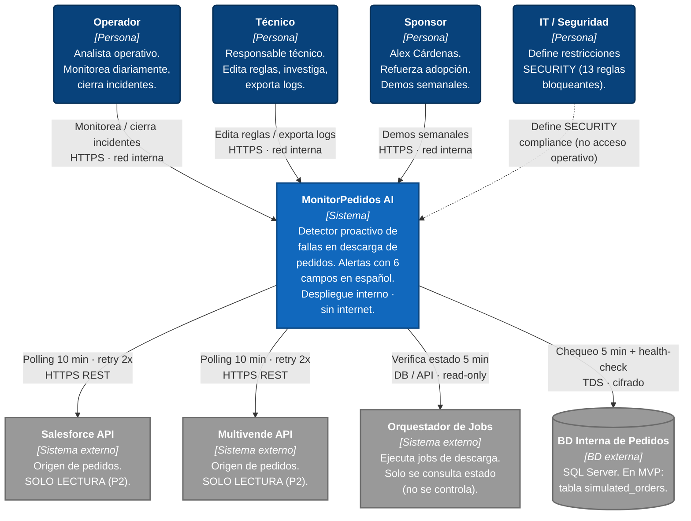
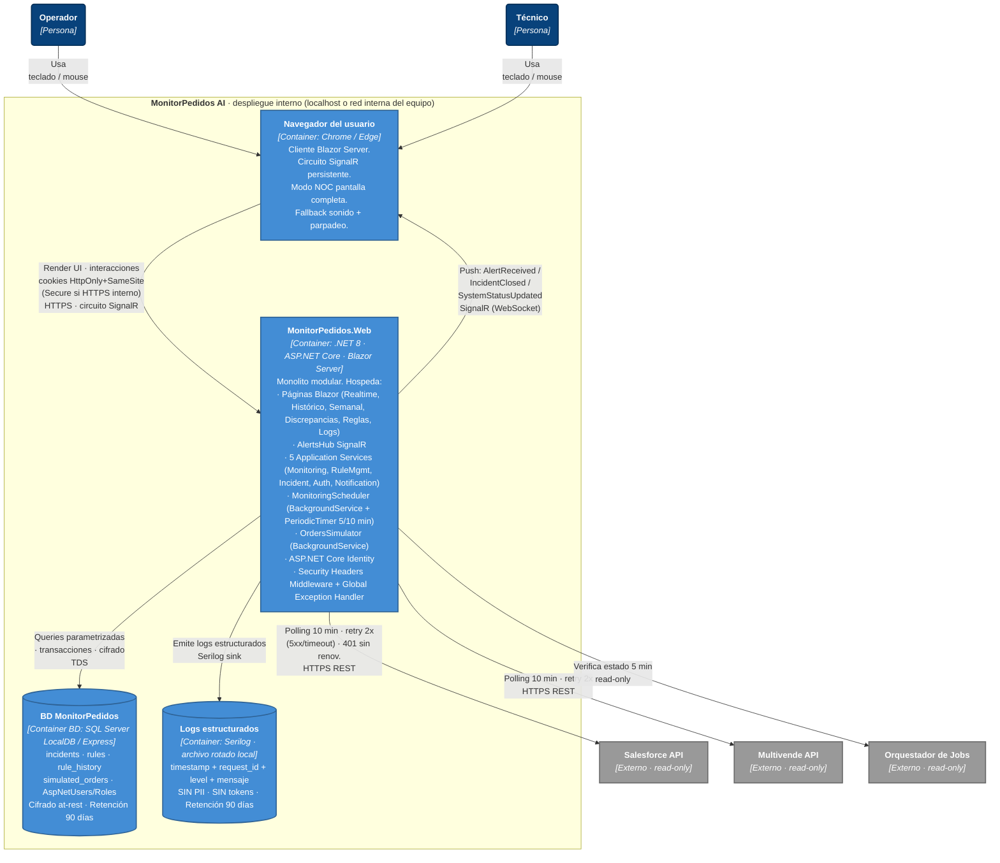

# C4 Model — MonitorPedidos AI

**Fecha:** 2026-05-22
**Versión:** 1.1 — diagramas reescritos en sintaxis `flowchart` estándar (compatible con Mermaid 8+).
**Stage:** Inception → Application Design (artefacto complementario)
**Alcance:** Niveles 1 (System Context) y 2 (Container) del C4 Model.
**Fuentes:** [`prd.md`](../../../prd.md) v2.3, [`requirements.md`](../requirements/requirements.md) v1.1, [`components.md`](./components.md), [`component-dependency.md`](./component-dependency.md).

---

## Sobre la sintaxis Mermaid usada

Estos diagramas usan **`flowchart TB` estándar** con `classDef` para reproducir visualmente las convenciones de C4 (colores y formas estándar de Simon Brown). Esto garantiza renderizado en **cualquier versión de Mermaid 8+**, incluyendo:

- VS Code con extensión *Markdown Preview Mermaid Support*.
- GitHub / GitLab render nativo.
- Cualquier viewer Markdown moderno (Obsidian, Notion-style, etc.).
- [mermaid.live](https://mermaid.live).

**Convenciones de color C4 aplicadas:**

| Color | Tipo | Hex |
|-------|------|-----|
| 🔵 Azul oscuro | Person (usuario / stakeholder) | `#08427B` |
| 🔷 Azul medio | System (en alcance) | `#1168BD` |
| 🟦 Azul claro | Container | `#438DD5` |
| ⚪ Gris | External System | `#999999` |

> **Alternativa nativa C4:** Mermaid 10+ soporta `C4Context`/`C4Container` directamente. Si tu renderer ya está actualizado y prefieres la sintaxis nativa, la versión 1.0 de este documento (en git history o por solicitud) la incluye.

---

## ¿Qué es C4 Model?

| Nivel | Nombre | Audiencia | Foco |
|-------|--------|-----------|------|
| **1** | **System Context** | Cualquier stakeholder | El sistema como caja negra en su entorno: quién lo usa, con qué se integra. |
| **2** | **Container** | Equipo técnico y arquitectos | Procesos / servicios / BD que componen el sistema, y cómo se comunican. |
| 3 | Component | Desarrolladores | Componentes internos de cada container. *(Ver [`components.md`](./components.md).)* |
| 4 | Code | Desarrolladores | Firmas / código. *(Ver [`component-methods.md`](./component-methods.md).)* |

Aquí cubrimos los **niveles 1 y 2**.

---

## Nivel 1 — System Context Diagram

**Propósito:** MonitorPedidos AI como caja negra en su entorno.

### Lectura

- **4 personas** se relacionan con el sistema.
  - **Operador** y **Técnico** son los únicos con interacción operativa diaria.
  - **Sponsor** accede en demos semanales internas.
  - **IT/Seguridad** **no accede al sistema**; solo impone las 13 restricciones SECURITY bloqueantes (relación punteada = compliance, no operativa).
- **4 sistemas externos**: Salesforce y Multivende (read-only por P2), Orquestador de Jobs (solo consulta), BD Interna de Pedidos (en MVP simulada).
- **Restricción crítica del despliegue:** sin exposición a internet. Todo acceso por **localhost** o **red interna del equipo**.

---

## Nivel 2 — Container Diagram

**Propósito:** abrir la caja negra del Nivel 1 y mostrar los containers (procesos, servicios, BD).

### Lectura

**4 containers dentro del boundary del sistema:**

| Container | Tecnología | Función |
|-----------|------------|---------|
| **Navegador del usuario** | Chrome / Edge | Cliente Blazor Server con circuito SignalR persistente. |
| **MonitorPedidos.Web** | .NET 8 · ASP.NET Core · Blazor Server | Único proceso de app. UI + hubs + services + scheduler + simulator + selección de identidad (cookie auth) + middlewares. |
| **BD MonitorPedidos** | SQL Server LocalDB / Express | Persistencia: incidentes, reglas + historial, datos simulados. Sin tablas de usuarios (identidad sin credenciales). Cifrado at-rest. |
| **Logs estructurados** | Serilog · archivo local rotado | Audit trail estructurado sin PII (RNF-08 + SECURITY-03). |

**Comunicaciones clave:**

- **Navegador ↔ Web:** circuito SignalR sobre WebSocket (Blazor Server). Cookies con `HttpOnly` + `SameSite=Strict` + `Secure` (cuando HTTPS interno). Doble flecha = real-time push servidor → cliente.
- **Web → BD:** TDS cifrado, consultas **parametrizadas** (SECURITY-05).
- **Web → APIs externas:** HTTPS REST con **política Polly** (máx 2 reintentos, solo 5xx/timeout). Ante 401, no renueva automáticamente.
- **Web → Logs:** Serilog sink con filtros explícitos de PII / tokens (no hay contraseñas en el modelo simplificado de identidad).

**Despliegue:** los 4 containers conviven en **una sola máquina** (localhost del owner o equipo de la red interna). Sin separación de hosts, sin exposición pública.

---

## Trazabilidad con artefactos existentes

| Elemento C4 | Documento Inception | Notas |
|-------------|---------------------|-------|
| Personas (L1) | [`personas.md`](../user-stories/personas.md) | 4 perfiles formalizados |
| Sistemas externos (L1) | [`requirements.md`](../requirements/requirements.md) C-04 (read-only) | Restricción P2 |
| Container Web (L2) | [`components.md`](./components.md) | 11 módulos M1–M11 + 5 services + hub |
| Container BD (L2) | [`components.md`](./components.md) §2.2 + [`component-methods.md`](./component-methods.md) | Entidades + repositorios |
| Comunicaciones (L2) | [`component-dependency.md`](./component-dependency.md) §3 | Patrones: in-process + SignalR + HTTP |
| **Nivel 3 (Component)** | [`components.md`](./components.md) + [`component-dependency.md`](./component-dependency.md) | Ya cubierto |
| **Nivel 4 (Code)** | [`component-methods.md`](./component-methods.md) | Firmas; implementación = Construction |

---

## Cómo visualizar

- **VS Code**: extensión *Markdown Preview Mermaid Support* (o similar) + abrir este archivo en preview.
- **mermaid.live**: pega cada bloque de código entre triples backticks.
- **GitHub / GitLab**: render nativo dentro de archivos `.md`.

Estos diagramas funcionan con **cualquier Mermaid 8+** — no requieren actualización del renderer.
