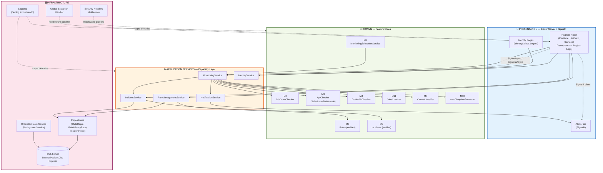
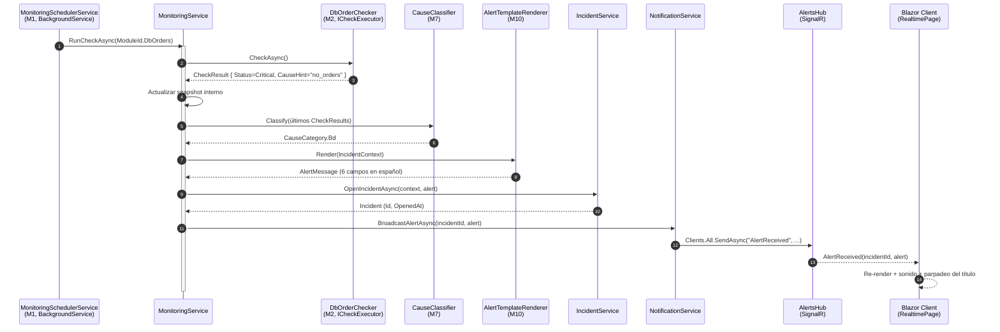
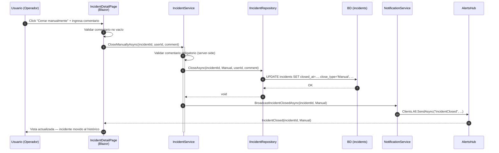
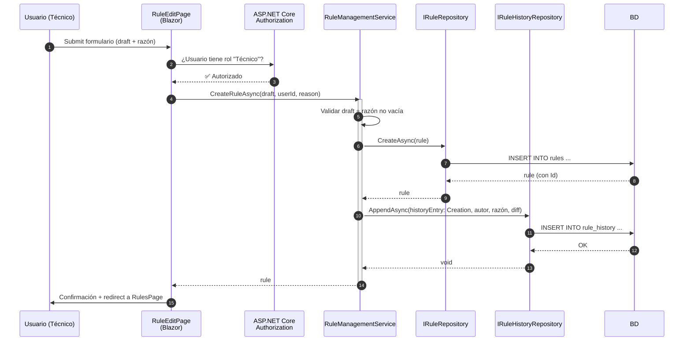

# Component Dependency — MonitorPedidos AI

**Fecha:** 2026-05-21
**Versión:** 1.0
**Stage:** Inception → Application Design (Part 2 — Generation)
**Alcance:** matriz de dependencias entre componentes + patrones de comunicación + diagrama de flujo de datos.

---

# 1. Diagrama de capas y dependencias

**Lectura:**

- **Flechas continuas** = dependencia directa (un componente invoca a otro).
- **Flechas punteadas** = comunicación indirecta (cliente SignalR, middleware pipeline, logging cross-cutting).
- Las capas se respetan estrictamente: Presentation → Services → Domain → Infrastructure. **No** hay flechas hacia arriba.

---

# 2. Matriz de dependencias

| Componente | Depende de (qué necesita) | Tipo |
|------------|----------------------------|------|
| **MonitoringSchedulerService (M1)** | `IMonitoringService` | Directa |
| **DbOrderChecker (M2)** | `IRuleRepository`, `DbContext` | Directa |
| **ApiChecker (M3)** | `ISalesforceClient`, `IMultivendeClient`, política Polly | Directa |
| **DbHealthChecker (M4)** | `DbContext` | Directa |
| **JobsChecker (M11)** | `DbContext` o `IJobStatusClient` (interfaz a definir en NFR Design) | Directa |
| **CauseClassifier (M7)** | Sin dependencias salientes (puro) | — |
| **AlertTemplateRenderer (M10)** | Sin dependencias salientes (puro) | — |
| **MonitoringService** | Todos los `ICheckExecutor`, `ICauseClassifier`, `IAlertExplainer`, `IIncidentService`, `INotificationService` | Directa |
| **RuleManagementService** | `IRuleRepository`, `IRuleHistoryRepository` | Directa |
| **IncidentService** | `IIncidentRepository` | Directa |
| **IdentityService** | `IHttpContextAccessor` (para `SignInAsync`/`SignOutAsync`), `PredefinedIdentities` | Directa |
| **NotificationService** | `IHubContext<AlertsHub>` | Directa |
| **AlertsHub** | (recibe inyección de `IHubCallerContext`) | Framework |
| **Páginas Blazor (UI)** | `IMonitoringService`, `IRuleManagementService`, `IIncidentService`, `IIdentityService`, `IRuleHistoryRepository`, `ITechnicalLogReader` | Directa |
| **OrdersSimulatorService** | `DbContext` (o `ISimulatedOrdersWriter`) | Directa |
| **Security Headers Middleware** | Ninguna | — |
| **Global Exception Handler** | `ILogger` | Directa |
| **Serilog (logging)** | (cross-cutting; lo usa todo el sistema) | Indirecta |
| **Repositories (Infrastructure)** | `DbContext` / Dapper connection | Directa |

## 2.1 Componentes sin dependencias salientes (puros)

- `CauseClassifier` (M7) — domain service puro, fácil de testear.
- `AlertTemplateRenderer` (M10) — domain service puro.
- Modelos del `Domain/` — POCOs sin métodos de I/O.

**Beneficio:** estos componentes son los más fáciles de unit-testear; cubren reglas de negocio críticas (clasificación de causa + 6 campos de alerta) sin necesidad de mocks.

## 2.2 Componentes sin dependientes (hojas)

- **AlertsHub** — solo el `NotificationService` le escribe; clientes Blazor le leen.
- **OrdersSimulatorService** — corre en background, no es consumido por nadie.
- **Security Headers Middleware** — solo participa del pipeline HTTP.

---

# 3. Patrones de comunicación

## 3.1 In-process method call (síncrono / async)

**Patrón principal.** Toda invocación entre componentes ocurre como llamada a método dentro del mismo proceso ASP.NET Core (decisión Q1 = monolito modular). Cero IPC, cero red, cero serialización.

**Ejemplos:**

- `MonitoringSchedulerService` → `IMonitoringService.RunCheckAsync(...)`
- `IMonitoringService` → `ICheckExecutor.CheckAsync(...)`
- `IRuleManagementService` → `IRuleRepository.CreateAsync(...)`

**Trade-off:** acoplamiento en proceso es alto pero el costo de latencia es nulo y el debugging es directo. Adecuado para un MVP.

## 3.2 Real-time push (SignalR sobre WebSocket)

**Único uso de canal no-síncrono.** El `NotificationService` empuja eventos a clientes conectados vía `AlertsHub`. Los clientes Blazor Server reciben los eventos a través del circuito SignalR ya establecido.

**Eventos emitidos:**

- `AlertReceived(incidentId, alert)` — cuando se crea un incidente WARN/CRITICAL.
- `IncidentClosed(incidentId, closeType)` — cierre auto o manual.
- `SystemStatusUpdated(snapshot)` — refresh periódico del estado global.

**Fallback (RF-25):** si la `Notification API` del navegador está bloqueada, el cliente Blazor sigue recibiendo los eventos vía SignalR y aplica sonido + parpadeo del título de la pestaña como degradación.

## 3.3 Persistencia (repositorios sobre `DbContext` / equivalente)

Todos los accesos a BD pasan por interfaces de repositorio (`IRuleRepository`, `IRuleHistoryRepository`, `IIncidentRepository`). La implementación concreta (`EF Core` o `Dapper`) se decide en NFR Design — Application Design solo fija las interfaces.

**Reglas:**

- **Lectura:** los repositorios pueden retornar entidades o records de proyección.
- **Escritura:** parametrized queries / EF Core con parámetros (SECURITY-05). **Nunca** concatenación SQL.
- **Transacciones:** las mutaciones que involucran múltiples tablas (p. ej. crear regla + insertar historial) usan transacción explícita en el repositorio o `DbContext.SaveChangesAsync()` único.

## 3.4 HTTP outbound (APIs externas, read-only)

`ApiChecker` invoca `ISalesforceClient` y `IMultivendeClient`, ambos `HttpClient`-wrappers tipados (registrados con `IHttpClientFactory`). Política de reintentos con Polly: solo 5xx / timeout, máximo 2 intentos (RF-06).

**Restricción inviolable:** ambas APIs externas son **solo lectura** (P2). Nunca se hace `POST`/`PUT`/`PATCH`/`DELETE`.

## 3.5 Authorization (middleware pipeline)

Las páginas Blazor usan atributos `[Authorize]` y `[Authorize(Roles="Técnico")]`. ASP.NET Core authorization middleware ejecuta antes de que la página se renderice. Si la validación falla → redirect a `/Identity/Select` (sin cookie) o 403 (cookie con rol insuficiente).

**Server-side enforcement (US-15 criterio 3):** un usuario con rol `Operador` que intente acceder a una ruta de `Técnico` recibe 403 desde el servidor, no solo UI escondida.

---

# 4. Flujo de datos — Detección a Notificación (UC1)

**Latencia esperada (RNF-01 = <10 min desde el fallo real):**

- Cadencia del chequeo: hasta 5 min (M2) o 10 min (M3).
- Procesamiento end-to-end del flujo arriba: <2 s en localhost.
- **Total worst-case:** ~10 min (caso peor) + 2 s ≈ cumple objetivo.

---

# 5. Flujo de datos — Cierre manual de incidente (US-13)

---

# 6. Flujo de datos — Crear regla con historial (US-19)

---

# 7. Reglas estructurales (qué NO está permitido)

| Regla | Justificación |
|-------|----------------|
| 🚫 Ninguna página Blazor puede inyectar `IRuleRepository`/`IIncidentRepository` directamente — debe usar el application service correspondiente. | Mantiene la responsabilidad de validación + historial dentro de los services (P5, US-19). |
| 🚫 Ningún componente que no sea `NotificationService` puede inyectar `IHubContext<AlertsHub>`. | Centraliza el broadcast en un punto único; facilita testing. |
| 🚫 Ningún `ICheckExecutor` puede invocar a otro `ICheckExecutor`. | Cada checker es atómico; la orquestación vive en `MonitoringService`. |
| 🚫 Ningún componente puede llamar `HttpContext.SignInAsync`/`SignOutAsync` directamente, salvo `IdentityService` y las Razor Pages de `/Identity/`. | Encapsula la emisión de cookies en un punto único. |
| 🚫 Repositorios no exponen `IQueryable` hacia fuera. | Evita leaky abstraction y SQL injection accidental. |
| 🚫 El `Domain/` no referencia `MonitorPedidos.Infrastructure` ni `MonitorPedidos.Web`. | Dependency inversion. |

---

# 8. Coverage de stories en este artefacto

| Story | Flujo / sección |
|-------|------------------|
| US-06 | §4 Detección a notificación |
| US-07, US-08, US-09, US-10 | §4 (cadencia y orquestación de checkers) |
| US-11, US-12 | §6 implícito (UI consume `IIncidentService.SearchHistoryAsync` / `GetWeeklySummaryAsync`) |
| US-13 | §5 Cierre manual |
| US-14 | §4 (flujo de cierre automático tras 2 OK) |
| US-15 | §3.5 Authorization |
| US-19, US-20, US-21, US-22 | §6 Crear regla con historial |
| US-23, US-24 | §3.5 + AuthService dependencies (§2) |
| US-25 | Logging cross-cutting (§3.3 indirecto, también referenciado en `services.md` §1.2) |
| US-26 | §3.3 Persistencia + Infrastructure (encriptación) |
| US-27 | Global Exception Handler (§2 cross-cutting) |
| US-28 | Security Headers Middleware (§2 cross-cutting) |
| US-29 | Concurrencia 5 usuarios — soportada por Blazor Server + SignalR (§1 capa Presentation) |

---

# 9. Resumen ejecutivo

- **4 capas claras** (Presentation, Services, Domain, Infrastructure) con dependencias estrictamente descendentes.
- **18 componentes** (11 funcionales M1–M11 + 7 cross-cutting) descritos en `components.md`, firmas en `component-methods.md`, orquestación en `services.md`.
- **3 patrones de comunicación**: in-process calls (principal), SignalR push (UI real-time), HTTP outbound read-only (Salesforce/Multivende).
- **6 reglas estructurales** que mantienen el sistema bajo control y testeable.
- **Application Design — cierre:** todas las stories tienen al menos un componente, un service y un flujo de datos identificado. Listo para Units Generation, donde estos componentes se agruparán en unidades de trabajo coherentes.
