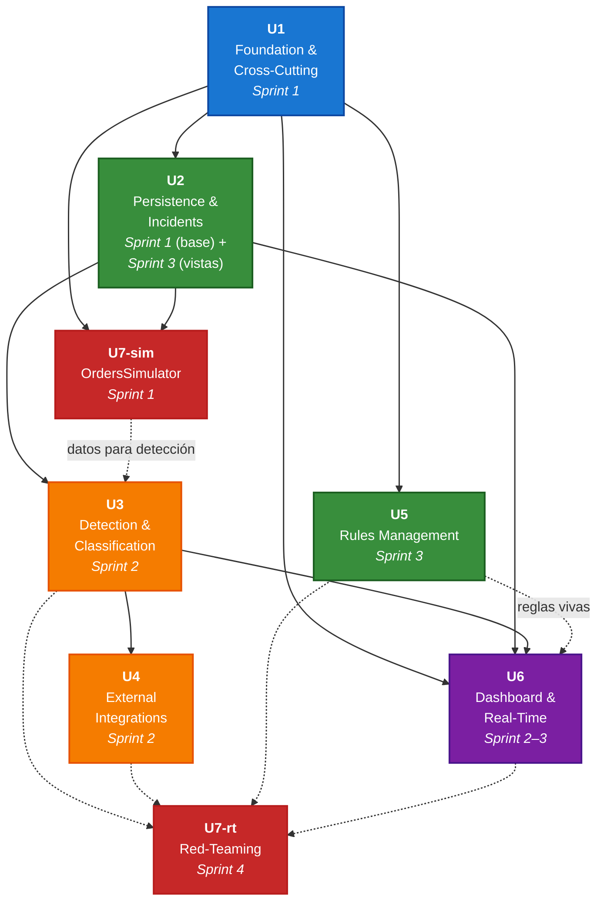

# Unit of Work Dependency — MonitorPedidos AI

**Fecha:** 2026-05-22
**Versión:** 1.0
**Stage:** Inception → Units Generation (Part 2 — Generation)
**Decisión Q4 del plan:** Matriz + Mermaid + clasificación por capa.
**Fuentes:** [`unit-of-work.md`](./unit-of-work.md), [`component-dependency.md`](./component-dependency.md).

---

## 1. Clasificación por capas

| Capa | Unidades | Característica |
|------|----------|----------------|
| **1 — Foundation** | U1 Foundation & Cross-Cutting | Prerequisito de todo. Sin dependencias salientes. |
| **2 — Persistence / Domain** | U2 Persistence & Incidents · U5 Rules Management | Persistencia + lógica de dominio. Cada una depende solo de U1. |
| **3 — Capabilities** | U3 Detection & Classification · U4 External Integrations | Lógica de aplicación que consume Persistence/Domain. U4 depende de U3 (extiende M3 dentro del flujo). |
| **4 — Presentation & Real-Time** | U6 Dashboard & Real-Time | Consume Persistence + Capabilities. Implementa la capa visual y el push SignalR. |
| **5 — Validation / Special** | U7 Simulation & Red-Teaming | Tiene dos modos: simulator (Sprint 1, depende solo de U1+U2) y red-teaming (Sprint 4, depende de todas). |

---

## 2. Matriz de dependencias (N×N)

Filas = unidad que depende. Columnas = unidad de la que depende. `✅` = dependencia **directa**; `⚠️` = dependencia **suave / parcial / temporal** (se explica en notas).

|       | **U1** | **U2** | **U3** | **U4** | **U5** | **U6** | **U7** |
|-------|--------|--------|--------|--------|--------|--------|--------|
| **U1** | —      |        |        |        |        |        |        |
| **U2** | ✅     | —      |        |        |        |        |        |
| **U3** | ✅     | ✅     | —      |        |        |        | ⚠️¹    |
| **U4** | ✅     |        | ✅     | —      |        |        |        |
| **U5** | ✅     |        |        |        | —      |        |        |
| **U6** | ✅     | ✅     | ✅     |        | ⚠️²   | —      |        |
| **U7** | ✅     | ✅     | ⚠️³   | ⚠️³   | ⚠️³   | ⚠️³   | —      |

### Notas

1. **U3 ⚠️ depende temporalmente de U7** — para que M2 (DbOrderChecker) pueda detectar algo en Sprint 2, la tabla `simulated_orders` de U7 debe estar poblada. **Coordinación práctica:** U7 sub-objetivo 1 (simulator) corre en paralelo con U2 en Sprint 1, así que para Sprint 2 (cuando arranca U3) ya está listo.
2. **U6 ⚠️ depende suavemente de U5** — las páginas de gestión de reglas (`RulesPage`, `RuleEditPage`, `RuleHistoryPage`) están bajo el árbol `Features/Rules/` y su lógica vive en U5, pero el dashboard global (header, rutas, layout) puede arrancar antes. **Coordinación práctica:** U6 puede entrar a Sprint 2 con un placeholder en la sección de reglas; U5 lo reemplaza al cerrar Sprint 3.
3. **U7 ⚠️ depende de U3, U4, U5, U6 solo para red-teaming (Sprint 4)** — el sub-objetivo 1 de U7 (simulator) solo necesita U1+U2. El sub-objetivo 2 (red-teaming) requiere todo el sistema funcional para validar los 6 escenarios.

---

## 3. Diagrama Mermaid — Orden recomendado de ejecución



**Lectura del diagrama:**

- **Flechas continuas:** dependencia directa, bloquea el inicio.
- **Flechas punteadas:** dependencia suave o final (no bloquea el inicio pero sí el cierre).
- **Colores:** representan las 5 capas de la §1.
- **U7** se divide visualmente en U7-sim (Sprint 1) y U7-rt (Sprint 4) para mostrar que el red-teaming depende de TODO el sistema, mientras que el simulator solo de U1+U2.

---

## 4. Camino crítico

**Definición:** secuencia de unidades cuyo retraso impacta directamente la fecha de cierre del MVP.

```
U1 → U2 (base) → U3 → U6 (mínimo) → U6 (completo) → U7-rt
Sprint 1   Sprint 1   Sprint 2   Sprint 2          Sprint 3       Sprint 4
```

- **U1** es bloqueante absoluto: cualquier retraso aquí retrasa todo.
- **U3** es la pieza de mayor valor funcional (detección automática). Su demora retrasa la posibilidad de mostrar valor real al sponsor.
- **U6 completo** debe estar listo antes del Sprint 4 para que el red-teaming valide flujos UI.

## 5. Oportunidades de paralelización

Una vez U1 está completa, se puede paralelizar:

| Bloque paralelo | Unidades | Sprint(s) |
|-----------------|----------|-----------|
| Bloque A | U2 (base) + U7-sim (simulator) | Sprint 1 (paralelos tras U1) |
| Bloque B | U3 + U4 | Sprint 2 (U4 depende de U3 pero pueden traslaparse el último día de U3 con setup de U4) |
| Bloque C | U5 + U6 (completo) | Sprint 3 (independientes entre sí; ambos dependen de U1+U2+U3) |

**Implicación práctica:** con un equipo de 2 desarrolladores, el cronograma del MVP es alcanzable. Con 1 desarrollador, el camino crítico queda fijo y Should-Have podría sacrificarse (R4 del PRD).

---

## 6. Verificación de ausencia de ciclos

| Origen → Destino | Status |
|------------------|--------|
| U1 → U2 | ✅ |
| U1 → U3 | ✅ (transitivo vía U2) |
| U1 → U4 | ✅ (transitivo vía U3) |
| U1 → U5 | ✅ |
| U1 → U6 | ✅ |
| U1 → U7-sim | ✅ |
| U2 → U3 | ✅ |
| U2 → U6 | ✅ |
| U2 → U7-sim | ✅ |
| U3 → U4 | ✅ |
| U3 → U6 | ✅ |
| U5 → U6 | ⚠️ suave |
| U7-sim → U3 | ⚠️ suave (datos) |
| U3..U6 → U7-rt | ⚠️ suave (red-teaming final) |

**Análisis topológico:** el grafo es **acíclico** (DAG). Orden topológico válido:

`U1 → U2 → U7-sim → U3 → U4 → U5 → U6 → U7-rt`

(Otros órdenes válidos existen — los importantes son que U1 va primero y U7-rt va al final.)

✅ **0 ciclos detectados.**

---

## 7. Tabla resumen de coordinación

| Sprint | Unidades activas | Quién depende de quién |
|--------|------------------|-------------------------|
| **Sprint 1** | U1 → U2 (base) + U7-sim | U2 y U7-sim arrancan en cuanto U1 termina (paralelos) |
| **Sprint 2** | U3 → U4 + U6 (mínimo) | U3 primero; U4 entra al final de la semana; U6 mínimo puede arrancar tras U3 inicial |
| **Sprint 3** | U5 + U6 (completo) + U2 (vistas) | Paralelos; cierran con dashboard funcional + reglas vivas |
| **Sprint 4** | U7-rt + ajustes + demo | Red-teaming valida 6 escenarios; ajustes basados en hallazgos |

---

## 8. Reglas de coordinación entre unidades

| Regla | Justificación |
|-------|----------------|
| 🟢 **U1 debe cerrar antes de que cualquier otra unidad escriba su primer commit.** | Toda dependencia parte de Foundation; sin esto hay re-trabajo de configuración. |
| 🟢 **U7-sim debe cerrar al final de Sprint 1.** | U3 (Sprint 2) necesita datos en `simulated_orders` para validar M2. |
| 🟡 **U5 puede arrancar antes de que U3 cierre.** | Las migraciones de `rules` y `rule_history` y el `RuleManagementService` son independientes del scheduler. La integración (M7 consume reglas vivas) ocurre al final. |
| 🟡 **U6 mínimo (`RealtimePage` + `AlertsHub`) puede arrancar antes de que U3 cierre.** | El cliente Blazor puede mostrar un estado vacío hasta que el primer chequeo se ejecute. |
| 🔴 **U7-rt NO inicia hasta que U1..U6 están completas y el sistema corre end-to-end en localhost o red interna.** | Los 6 escenarios validan flujos completos; ejecutar antes desperdicia tiempo. |

---

## 9. Resumen

- **7 unidades en 5 capas** estructurales.
- **Grafo acíclico** verificado (DAG).
- **3 oportunidades de paralelización** identificadas por sprint.
- **Camino crítico:** U1 → U2 → U3 → U6 → U7-rt.
- **Próximo artefacto:** [`unit-of-work-story-map.md`](./unit-of-work-story-map.md) — mapeo bidireccional de las 29 stories.
