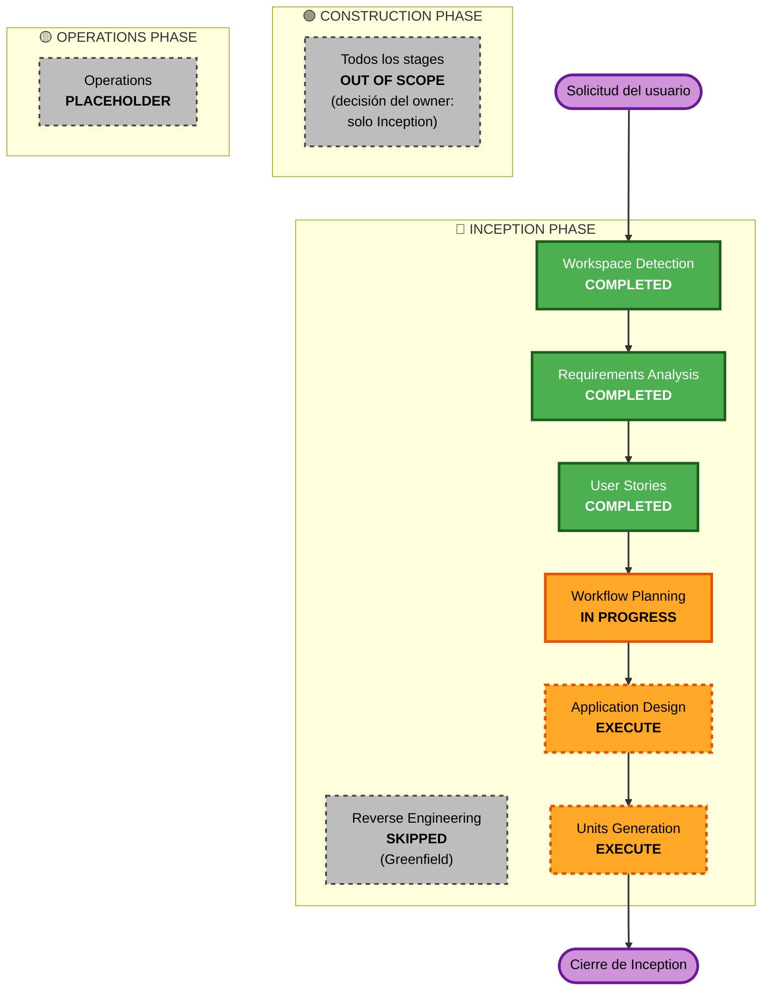

# Execution Plan — MonitorPedidos AI

**Fecha:** 2026-05-21
**Versión:** 1.0
**Stage:** Inception → Workflow Planning
**Profundidad:** Standard
**Tipo de proyecto:** Greenfield
**Fuentes:** [`prd.md`](../../../prd.md) v2.3, [`requirements.md`](../requirements/requirements.md) v1.1, [`stories.md`](../user-stories/stories.md), [`personas.md`](../user-stories/personas.md)

---

## 1. Detailed Analysis Summary

### 1.1 Transformation Scope

**Tipo:** Greenfield (sin código previo). No aplica análisis de transformación brownfield.

### 1.2 Change Impact Assessment

| Área | Impacto | Descripción |
|------|---------|-------------|
| **User-facing changes** | ✅ Alto | Dashboard nuevo con 4 vistas para 2 personas (Operador, Técnico); 29 stories funcionales y cross-cutting. |
| **Structural changes** | ✅ Alto | Sistema nuevo de 11 módulos lógicos (M1–M11) con scheduler, integraciones, BD, UI y motor de reglas. |
| **Data model changes** | ✅ Alto | Nuevas tablas necesarias: `incidents`, `rules`, `rule_history`, `simulated_orders`, `users`/`roles` (Identity), `logs`. |
| **API changes** | ⚠️ Limitado | Solo consumo **read-only** de Salesforce / Multivende (P2 — no modificamos APIs externas). No se exponen APIs públicas. |
| **NFR impact** | ✅ Alto | 15 RNFs activos, 13 reglas SECURITY aplicables como restricciones bloqueantes. |

### 1.3 Risk Assessment

| Atributo | Valor | Justificación |
|----------|-------|----------------|
| **Risk Level** | **Medium-High** | 11 módulos, 4 semanas, dependencias externas (Salesforce/Multivende, BD), SECURITY bloqueante. Mitigaciones documentadas en PRD §12 (R1–R10). |
| **Rollback Complexity** | N/A en Inception | No hay código aún; rollback se evaluará en Construction. |
| **Testing Complexity** | **Moderate** | 6 escenarios de red-teaming obligatorios (PRD §11) + unit tests + integration tests. |

### 1.4 Component Relationships

**N/A para greenfield** — los 11 módulos se diseñarán formalmente en el stage Application Design.

---

## 2. Workflow Visualization

**Lectura del diagrama:**

- **Verde (COMPLETED):** stages ya cerrados con aprobación del owner.
- **Naranja (IN PROGRESS / EXECUTE):** stages activos o por ejecutar dentro de Inception.
- **Gris (SKIPPED / OUT OF SCOPE / PLACEHOLDER):** stages que no se ejecutarán en esta iteración.
- **Morado (Start / End):** límites del flujo planificado.

---

## 3. Phases to Execute

### 🔵 INCEPTION PHASE

| Stage | Estado | Decisión | Rationale |
|-------|--------|----------|-----------|
| Workspace Detection | ✅ COMPLETED | — | Confirmado greenfield el 2026-05-20. |
| Reverse Engineering | ⏭️ SKIPPED | — | Greenfield — no hay código previo que ingenierear. |
| Requirements Analysis | ✅ COMPLETED | — | `requirements.md` v1.1 aprobado; 30 RF, 15 RNF, 13 reglas SECURITY aplicables. |
| User Stories | ✅ COMPLETED | — | `stories.md` aprobado; 29 stories en formato Connextra + Given/When/Then; cobertura 30/30 RF, 7/7 UC, 6/6 RT. |
| **Workflow Planning** | 🔄 **IN PROGRESS** | — | Este documento. |
| **Application Design** | ⏳ Pendiente | ✅ **EXECUTE** | Sistema greenfield con **11 módulos lógicos (M1–M11)** que necesitan definición formal de responsabilidades, métodos públicos, dependencias y patrones de interacción. Sin Application Design, Construction posterior arrancaría sin contrato entre componentes. Es la única vía limpia para descomponer el sistema en unidades de trabajo. **Profundidad recomendada:** Standard. |
| **Units Generation** | ⏳ Pendiente | ✅ **EXECUTE** | Once Application Design defina los 11 módulos, **Units Generation los agrupa en unidades de trabajo coherentes** que podrán construirse y testearse de forma independiente (alineado con los 4 sprints del PRD §13). Crítico para distribuir trabajo y para que Construction (futura) tenga unidades estimables. **Profundidad recomendada:** Standard. |

**Total INCEPTION stages a ejecutar:** 2 pendientes (Application Design + Units Generation) tras este Workflow Planning.

### 🟢 CONSTRUCTION PHASE

> **🚫 OUT OF SCOPE para esta iteración** — por decisión explícita del owner en la solicitud inicial: *"Por ahora, el enfoque se limita únicamente a la fase de Inception."*

| Stage | Decisión | Rationale |
|-------|----------|-----------|
| Functional Design (per-unit) | 🚫 OUT OF SCOPE | Se ejecutará al activar Construction en una iteración futura. |
| NFR Requirements (per-unit) | 🚫 OUT OF SCOPE | Idem. |
| NFR Design (per-unit) | 🚫 OUT OF SCOPE | Idem. |
| Infrastructure Design (per-unit) | 🚫 OUT OF SCOPE | Idem. |
| Code Generation (per-unit) | 🚫 OUT OF SCOPE | Idem. |
| Build and Test | 🚫 OUT OF SCOPE | Idem. |

**Nota:** todos los artefactos de Inception (requirements, stories, application design, units) están diseñados para alimentar Construction directamente cuando el owner decida activarla — no se requieren cambios estructurales para retomar.

### 🟡 OPERATIONS PHASE

| Stage | Decisión | Rationale |
|-------|----------|-----------|
| Operations | 📦 PLACEHOLDER | Stage futuro del framework AI-DLC; no aplica al ciclo actual. |

---

## 4. Cronograma de Inception (estimado)

| Stage | Esfuerzo estimado | Dependencias |
|-------|---------------------|---------------|
| Workflow Planning (este doc) | 1–2 h | Requirements + Stories aprobados |
| **Application Design** | ½–1 día | Workflow Planning aprobado |
| **Units Generation** | ½ día | Application Design aprobado |
| **Cierre de Inception** | — | Units Generation aprobado |

**Total restante en Inception:** ~1–1.5 días de trabajo.

> **Nota sobre el cronograma del producto:** los 4 sprints del PRD §13 (4 semanas) corresponden a la fase de Construction (cuando se decida activarla). El cronograma anterior es solo de los stages restantes de Inception.

---

## 5. Success Criteria

### 5.1 Primary Goal

Cerrar la fase de **Inception** con todos los artefactos necesarios para que un equipo (humano o asistido por AI) pueda arrancar Construction sin ambigüedades:

- ✅ PRD vigente (v2.3).
- ✅ Requirements claros con 30 RF + 15 RNF + criterios de aceptación red-teaming.
- ✅ Stories con trazabilidad RF/UC/RT.
- ⏳ Application Design con 11 módulos formalizados (responsabilidades, métodos, dependencias).
- ⏳ Units Generation con unidades de trabajo agrupadas y secuenciables.

### 5.2 Key Deliverables (Inception completa)

| Documento | Estado |
|-----------|--------|
| `aidlc-docs/inception/requirements/requirements.md` | ✅ v1.1 |
| `aidlc-docs/inception/user-stories/personas.md` | ✅ v1.0 |
| `aidlc-docs/inception/user-stories/stories.md` | ✅ v1.0 |
| `aidlc-docs/inception/plans/execution-plan.md` | 🔄 Este documento |
| `aidlc-docs/inception/application-design/application-design.md` | ⏳ Pendiente |
| `aidlc-docs/inception/application-design/component-diagram.md` | ⏳ Pendiente |
| `aidlc-docs/inception/plans/units-generation.md` | ⏳ Pendiente |

### 5.3 Quality Gates

- **Trazabilidad:** cada módulo del Application Design debe enlazar a ≥1 RF y a ≥1 story.
- **SECURITY:** cualquier módulo que toque autenticación, BD, logging o validación de input debe documentar qué reglas SECURITY satisface.
- **Coherencia:** la lista de módulos debe alinear con M1–M11 del PRD §9 (incluyendo nota de M5 fusionado con M6).
- **Aprobación explícita:** cada stage cierra con aprobación del owner antes de avanzar.

---

## 6. Adaptive Detail Notes

Per [`depth-levels.md`](../../../aidlc-rule-details/common/depth-levels.md):

- **Application Design — depth Standard:** se generarán los artefactos definidos (`application-design.md` + `component-diagram.md`) con detalle suficiente para describir cada módulo M1–M11 con sus responsabilidades, métodos principales y dependencias. No se inflarán con sub-detalles de implementación (eso es Functional Design en Construction).
- **Units Generation — depth Standard:** unidades agrupadas por afinidad funcional/sprint, con dependencias entre unidades y criterios de cierre. No se generará nivel de pseudocódigo (eso es Construction).

---

## 7. Out-of-scope explícitos (para evitar ambigüedad futura)

- Construction phase completa.
- Despliegue, instalación de runtime, configuración de servidor.
- Failbook (queda como documento externo — `requirements.md` C-08).
- TBDs activos del PRD Anexo B (TBD-D4, TBD-S3-org, TBD-S3-verbatims) — diferidos a Sprint 1.
- Renovación automática de tokens, reintento automático de jobs (Decisión #2 del PRD — son `Won't Have v1`).

---

## 8. Próximo paso

→ Tras aprobación de este Execution Plan, ejecutar stage **Application Design** (siguiente en la secuencia naranja del diagrama Mermaid).
