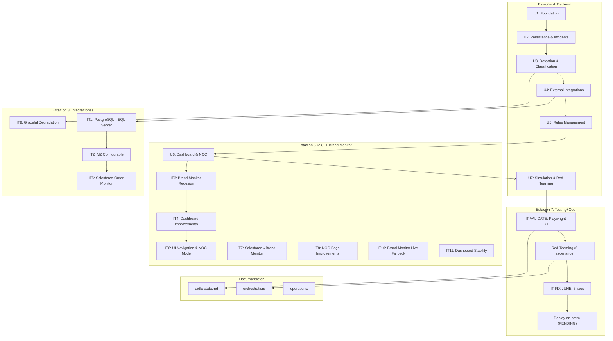

# Orchestration Map — MonitorPedidos AI

## Architecture Overview



## Milestone Progress

| Milestone | Tasks | Status |
|-----------|-------|--------|
| MS1: Inception | 001-002 | ✅ COMPLETED |
| MS2: MVP Core | 003-009 | ✅ COMPLETED |
| MS3: SQL Server + Config | 010-011 | ✅ COMPLETED |
| MS4: Brand + Dashboard | 012-013 | ✅ COMPLETED |
| MS5: Salesforce | 014-016 | ✅ COMPLETED |
| MS6: Stability | 017-020 | ✅ COMPLETED |
| MS7: Validate + Red-Team | 021-023 | ✅ COMPLETED |
| MS8: Operations Ready | 024-025 | 🟡 IN PROGRESS |

## File Map
```
aidlc-docs/orchestration/
├── task-package.yaml      # 25 tareas, 8 milestones
├── milestones.md          # MS1-MS8 detalles
├── harness-ficha.md       # OpenCode capabilities
├── orchestration-map.md   # This file
├── linear-publish.yaml    # Linear publishing config
└── tasks/
    ├── 001-inception.md
    ├── 002-unit-1-foundation.md
    ├── 003-unit-2-persistence.md
    ├── 004-unit-3-detection.md
    ├── 005-unit-4-integrations.md
    ├── 006-unit-5-rules.md
    ├── 007-unit-6-dashboard.md
    ├── 008-unit-7-simulation.md
    ├── 009-build-and-test-mvp.md
    ├── 010-it1-sqlserver.md
    ├── 011-it2-m2-configurable.md
    ├── 012-it3-brand-monitor.md
    ├── 013-it4-dashboard.md
    ├── 014-it5-salesforce.md
    ├── 015-it6-ui-navigation.md
    ├── 016-it7-brand-sf.md
    ├── 017-it8-noc.md
    ├── 018-it9-graceful.md
    ├── 019-it10-live-fallback.md
    ├── 020-it11-stability.md
    ├── 021-validate-playwright.md
    ├── 022-red-teaming.md
    ├── 023-it-fix-june.md
    ├── 024-orchestration-docs.md
    └── 025-deploy-onprem.md
```
